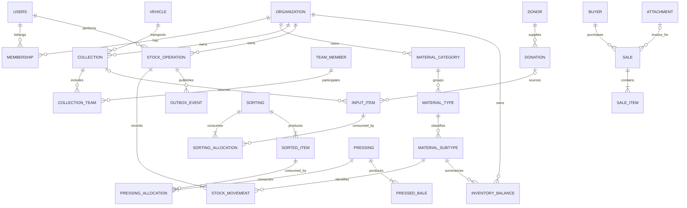

# ADR-0002: PostgreSQL integrity, scoped inventory and safe schema evolution

> Database execution update: [ADR-0007](0007-fresh-database-baseline.md) replaces the active historical migration chain with one fresh English V1. Old databases are preserved, not automatically upgraded or deleted.

> Execution update (2026-09-26): the owner confirmed no production deployment and authorized backend/database refactoring. [ADR-0005](0005-preproduction-docker-foundation.md) governs Docker Compose, pre-production compatibility, closed legacy PRs and staged implementation. Historical audit tables below remain dated evidence.

- Documentation maintainer: [Enzo Ribas (@oEnzoRibas)](https://github.com/oEnzoRibas).
- Status: Proposed; conceptual target, not an executable migration or production schema certification.
- Recorded: 2026-09-23.
- Scope: backend schema and frontend-visible data contracts.
- Baseline: backend `develop` at `0e675044018f1cfb7c52f7c722aafc49a499d53a`, Flyway V1–V4.
- Related: [master plan](0001-master-plan.md), [architecture and dependencies](0003-architecture-and-dependencies.md).

## Context

The active code uses PostgreSQL 16 in Compose, UUID keys, `NUMERIC(15,4)` quantities, `NUMERIC(15,2)` monetary fields, timestamp-with-time-zone columns, Spring Data JPA and Flyway. Hibernate runs `ddl-auto=validate`. The database itself was not connected or inspected. Backend `main` is a historical, different model with a MySQL driver; its migration history cannot be presumed compatible with current V1.

Twenty-one tables are declared in current V1, including one collection-team join table. V2 adds material hierarchy versions; V3 adds inventory balance version; V4 adds polymorphic destination fields. The tables already model much of the domain. A replacement database engine is not justified. The problems are integrity, ownership, lifecycle and accounting boundaries.

### Current topology and defects

| Area / current tables | Important relationships | Observed gap |
| --- | --- | --- |
| `users` | Unique email; role and active state | No organization/membership; role is not an organization identifier |
| `material_category`, `material_type`, `material_subtype` | Category → type → subtype; creator and versions | No scoped natural-key uniqueness; code access differs between materials and intake |
| `attachment` | Creator and filesystem path | No upload lifecycle, size/hash or integrity-coordinated deletion |
| `vehicle`, `team_member` | Creator; collection references both | License plate checked in service but not unique in SQL; member role unconstrained |
| `donor`, `buyer` | Referenced by donation/sale | Document identity not normalized/unique; donor address requested by #65 absent |
| `collection`, `collection_team` | Vehicle, driver, team and attachments | Route, departure/arrival and distance requested by #64 are absent from current schema |
| `donation` | Donor and optional proof | Header total can disagree with items; editing deactivates source items even if processing refers to them |
| `input_item` | Nullable collection and donation parents; subtype | Can have neither or both parents; no positive/nonnegative checks |
| `sorting`, `sorted_item` | Optional input item; output subtype and rejection quantities | Source allocations can be repeated or cross scope; no conservation constraints |
| `pressing`, `pressed_bale` | Optional sorted item; weight, initial/final volumes | Optional source enables untraceable processing; arbitrary destination UUID has no FK |
| `sale`, `sale_item` | Buyer, attachments and subtype | Invoice optional even though posting requires it; item parent nullable; no stock allocation |
| `inventory_log` | Subtype, quantities and operation enum | No operation/source/actor/owner FK or idempotency; mutable active filter; cannot reliably rebuild stock |
| `inventory_balance` | Subtype, quantity, volume and version | No unique subtype key; global scope conflicts with creator-filtered domain records |

Most FK columns lack explicit secondary indexes. PostgreSQL does not automatically create an index on the referencing side of every FK. Verify the live catalog before adding any index; migration text alone does not prove its deployed presence or absence.

There is also source-level mapping drift: `Attachment.fileName` declares length 900 while V1 declares `file_name VARCHAR(255)`. Hibernate validation must not be assumed to detect every length/constraint mismatch. Define an accepted filename length, validate it in the request boundary, and use a new widening migration only if the longer limit is required.

## Decision drivers

Prevent overconsumption and repeated posting; make ledger and balances reconcile; preserve evidence of historical operations; enforce the correct association/organization boundary; eliminate ambiguous parent/source relationships; support backdated corrections without erasing history; migrate real previous installations without changing applied SQL.

## Considered options

| Option | Pros | Cons | Result |
| --- | --- | --- | --- |
| Retain schema and rely on DTO validation | Fast, minimal DDL | Bypassable by jobs/imports, first-write races remain, weak history | Rejected |
| Replace SQL with a document store | Flexible intake shapes | Weak fit for relational references, stock transactions and reporting; migration cost | Rejected |
| Full event sourcing and CQRS platform | Rich replay and audit | Large rewrite and event-versioning burden, incomplete legacy provenance | Deferred |
| Retain relational operational tables, introduce an immutable posting ledger and constrained projections | Transactional, inspectable, incremental, rebuildable within defined semantics | New lifecycle/ledger code and reconciled opening balances | Selected |
| Retain global inventory keyed only by subtype | Small migration | Cannot isolate partner inventories or same-material stocks held by different organizations | Rejected for partner operations |

## Decision

Keep PostgreSQL. Use UUIDs for new persistent identities and preserve existing UUIDs. Retain the category/type/subtype hierarchy rather than replacing it with an unrestricted recursive taxonomy. Add explicit organization ownership, transactional stock posting, immutable audit provenance, strict quantitative invariants and additive migrations. Separate operational mass from saleable stock: intake creates raw material provenance; accepted sorting output creates saleable stock. Pressing changes saleable volume without creating mass. Sales consume saleable mass/volume. Raw-material progress is tracked through source allocations, not by crediting the saleable balance twice.

### Ownership and authorization

Add `organization(id, name, organization_type, is_active, created_at, updated_at)` and `organization_membership(organization_id, user_id, role, is_active)` with a composite membership key. Preserve `creator_id` as the actor/audit field; never silently reinterpret it as the organization. Add `organization_id` to owned operational records, attachments, parties, inventory operations and balances. Administrative cross-organization access must be explicit and audited, not a missing filter.

Proposed default: each organization owns its catalog and stock, with an administrator-managed template used when initializing a catalog. This resolves current creator-only restrictions while avoiding an accidental global catalog. Product owners must accept this scope in M0; if a shared catalog is required, amend the model before DDL. Add `(organization_id,id)` unique keys and matching composite FKs where a child references an owned parent, preventing cross-organization links even if an application query forgets a scope filter. Derive scope from verified membership, never trust a request's organization ID alone.

Do not create an organization per historical user automatically. Obtain an explicit mapping, quarantine ambiguous rows, and backfill in bounded batches with reconciliation counts. Existing deployment scope remains unknown until this is done.

### Target topology

This ERD shows the intended additions and retained relationships, not the currently deployed database. Scalar attributes and audit columns are detailed in the inventory appendix. A movement source references the stock operation; typed operation-link tables anchor it to exactly one business document.

`INPUT_ITEM` belongs to exactly one collection or donation (XOR), despite each relationship being individually optional. A posted sale requires an invoice; draft sales may omit it. Source allocations allow one source to be split across outputs and multiple sources to contribute to a processing operation; aggregate consumption is checked under locks.

### Schema changes and invariants

| Change | Constraint / rule | Migration and validation |
| --- | --- | --- |
| Scoped balance | Unique `(organization_id, material_subtype_id)`; nonnegative weight/volume; retain `version` | Reconcile duplicate rows before unique index; never sum duplicates blindly because they may represent replayed operations |
| Input source | `num_nonnulls(collection_id, donation_id) = 1` | Quarantine invalid rows; add check as NOT VALID, then validate |
| Mandatory child parents | NOT NULL on sale item/sorted item/bale parent after repair | Identify orphans first; reject new invalid writes before backfill |
| Quantities | Operational weights > 0; volumes >= 0; rejects >= 0 and <= gross; compacted final volume < initial | Domain/DTO checks plus row-level DB checks; legacy violations reviewed, not clamped |
| Hierarchy identities | Unique normalized name within organization + parent | Define trim/case policy before backfill; preserve IDs and historical names |
| Vehicle identity | Unique normalized plate within organization; explicitly decide inactive reuse policy | Prefer no reuse until history policy is accepted; service duplicate check is only UX |
| Parties | Normalized document/type; scope uniqueness where required | Do not invent identifiers for legacy donors; record unknown values explicitly |
| Collection logistics | Add nullable `departure_at`, `arrival_at`, `route_description`, `distance_km NUMERIC(12,3)`; arrival >= departure and distance >= 0 when present | Backfill only from known records; require fields for new completed collections after contract rollout, not fabricated historical values |
| Donor address | Add a donor address record with donor FK, structured address fields and historical validity where required | Clarify required address components with product; preserve unknown legacy addresses rather than inserting placeholders |
| Sale posting | `status IN (DRAFT, POSTED, REVERSED)`; POSTED requires invoice and posting timestamp | Existing rows cannot be declared posted merely because a total exists |
| Money | BigDecimal, explicit currency and per-kg price basis; total calculated server-side | Keep existing values; adopt rounding policy before conversion; do not use floating point |
| Intake totals | Header total agrees with sum of active items within accepted scale | Cross-row checks belong in transactional service and reconciliation, not a row CHECK subquery |
| Timestamps | Business occurrence and recording times separate, both time-zone-aware | Retain historical timestamps and document display zone; no implicit browser Date parsing |
| References | RESTRICT deletion of posted evidence; retain inactive catalogs in historical reads | Audit global `@SQLRestriction` mappings so historical relations remain resolvable |

Use `NUMERIC(15,4)` and Java BigDecimal for mass and volume unless observed ranges require an explicit widened type. New v1 wire decimals use decimal strings; parse/form-format at the boundary. Currency is an explicit configured ISO currency code, not inferred from the operator's locale. Compute line totals with documented HALF_UP rounding to two fractional digits, then sum rounded lines; product accounting approval is a gate before applying this to historical amounts. Unit price may require four fractional digits; widening is additive and must be agreed before migration.

Avoid unbounded polymorphic `destination_type/destination_id`. Preserve the legacy columns while introducing explicit links: stock as a disposition with no arbitrary target ID, sale allocations with a sale-item FK, and pressing allocations with a pressing FK. Validate exactly one allowed disposition where appropriate. Do not pretend a CHECK on the enum proves the target UUID exists.

### Ledger and operation model

Introduce `stock_operation(id, organization_id, actor_id, operation_type, idempotency_key, request_hash, occurred_at, recorded_at, reversal_of, status)` and immutable `stock_movement(id, operation_id, line_number, material_subtype_id, delta_weight_kg, delta_volume_m3)`. Use unique `(organization_id, operation_type, idempotency_key)` and `(operation_id,line_number)`. Store the canonical request hash and result reference. A repeated key with the same hash returns the existing result; a different hash returns 409. A failed transaction leaves no committed key or partial postings.

Add typed `sorting_posting(operation_id, sorting_id)`, `pressing_posting(operation_id, pressing_id)`, `sale_posting(operation_id, sale_id)` and reviewed adjustment/opening links, with unique document IDs. A posting operation has exactly one typed source, enforced by the posting service plus a deferred constraint trigger if the multi-table design is retained. No generic UUID reference substitutes for referential integrity. Outbox events share the posting transaction and use unique operation/event identity for retry deduplication.

For saleable inventory, the invariant is `balance = SUM(all committed movement deltas, including OPENING)`, by organization and subtype. Opening balances are signed off from physical/business records because the existing log is not a trustworthy reconstruction source. Legacy logs remain retained evidence, separately labeled; do not replay them as new movements. Corrections use reversal and replacement operations rather than mutation/deactivation of historical ledger entries.

Concrete accounting examples:

- Sorting 100 kg gross with 10 kg reject credits **90 kg once**. Record 90 kg in the saleable ledger and 10 kg rejection in the processing record. The existing service produces ledger net 80 kg (90 minus 10) while balance rises 90 kg; do not carry that semantic mismatch forward.
- Pressing 90 kg from 10 m³ into 4 m³ records `delta_weight_kg = 0`, `delta_volume_m3 = -6`. It cannot log an additional 90 kg as a balance delta. If available volume is below 6 m³ or source allocation exceeds remaining material, reject the operation; never clamp to zero.
- Selling 20 kg consumes an available quantity atomically and writes the same negative delta to the ledger and projection. Two sales of 60 kg against 100 kg cannot both commit. The client-side stock display is advisory.
- Intake that later undergoes sorting must not also credit saleable stock at intake. If raw stock reporting is required, use a distinct RAW inventory stage/projection and transfer postings; do not mix RAW and SALEABLE balances under one key.

### Concurrency algorithm

In one database transaction: authenticate and resolve scope; claim idempotency; validate/load sources; initialize missing balance rows with `INSERT ... ON CONFLICT DO NOTHING` against the unique key; lock affected sources and balances in stable UUID/key order; verify remaining source allocation and nonnegative resulting balances; persist document, allocation, movement and projection; persist report/storage outbox event; commit. Existing-row `@Version` remains useful as an additional stale-update guard, but cannot prevent duplicate first inserts.

Use one consistent locking order across sorting, pressing and sales. Retry serialization/deadlock failures only as a whole transaction, bounded to a small configured count with backoff and the same idempotency key. Return an explicit retriable conflict when exhausted. No file upload or network call occurs while stock locks are held. PostgreSQL row locking and unique indexes, rather than JVM locks, coordinate multiple backend replicas.

### Attachments and reports

Store an opaque storage key, original display filename, detected media type, size, checksum, owner, creator and lifecycle state. Generate storage keys server-side without concatenating user paths. Bound size, inspect content signatures, restrict accepted formats, stream downloads and authorize every read/delete. Never serialize a JPA User (including passwordHash) through an Attachment response. A filesystem adapter is acceptable for isolated development; production needs durable storage with a tested recovery policy.

Upload pending content, validate, then associate/finalize metadata. Cleanup failed or expired uploads asynchronously. Mark deletion and create an outbox cleanup event in the database; delete physical content only after commit and retention/reference checks. Database rollback cannot restore a file already deleted. Backdated intake/processing/sale corrections enqueue a durable `REPORT_INVALIDATED` event; worker deduplication and versioned report outputs prevent lost recalculations after process restarts.

## Migration strategy

1. **Discover:** export schema-only metadata and Flyway history from the real environment; record driver/server versions and artifact IDs. Determine whether the deployment is legacy main/MySQL, earlier PostgreSQL or current V1–V4. Applied migration files and checksums are immutable.
2. **Protect:** consistent backup of database plus attachment manifest; restore rehearsal; known previous application images; explicit write-freeze/rollback checkpoints; measured DDL lock budget and available disk.
3. **Preflight:** count duplicate balances, normalized identities, orphan children, ambiguous input parents, negative quantities, missing owners and ledger/projection discrepancies. Export exception reports with IDs to a restricted operator location, not a public repository.
4. **Expand:** new versioned migrations after the highest deployed version add nullable scope/provenance fields, new organization/ledger/allocation/outbox tables and indexes. Do not assume the next safe number is V5 until concurrent branches and live history are checked. Use NOT VALID checks/FKs where supported, then validate after repair; this still enforces new rows and requires compatible writers.
5. **Backfill:** bounded batches keyed by stable ID, recorded progress/watermark and repeatable mappings. Backfill organizations from approved mappings, not creator guesses. Produce approved opening balances; retain legacy logs. If writes continue, deploy one transactionally consistent writer and an outbox/watermark reconciliation scheme before copying; otherwise use a short scoped write freeze. Do not rely on uncoordinated application dual writes.
6. **Constrain:** after duplicate resolution, create unique indexes and validate constraints, then enforce NOT NULL. On large tables use `CREATE INDEX CONCURRENTLY` in an explicitly nontransactional Flyway migration. Inspect invalid indexes on failure and remove/rebuild only the known failed index. Configure lock/statement timeouts and retry outside user transactions.
7. **Switch:** enable new posting path for a pilot organization; compare old reports, approved opening balances and new ledger totals. Old app compatibility must be tested against the expanded schema. Move frontend routes only when their contracts pass.
8. **Observe and contract:** run reconciliation at deployment and on schedule, require zero unexplained deltas, then retire legacy columns/routes only after ADR-0001's deprecation window. Removal is a separate reviewed migration with a retained archive and rollback plan.

For legacy main or an unknown schema, build a separate import adapter into a new verified target database and retain a source-ID → UUID mapping. Do not run current V1 over existing tables and rely on `IF NOT EXISTS`; that can hide incompatible column layouts. Current `baseline-on-migrate=true` must become an explicit operator action after schema validation; it is not a repair strategy. Never rewrite V1–V4, run `clean`, or erase history to force validation success.

## Consequences

Positive: database-enforced ownership and relationships, deterministic posting, replayable saleable balances, traceable corrections and predictable migration gates. Catalog and document history remain available.

Negative: more schema objects and indexes; write contention is explicit; source allocation/backfill needs domain decisions and operator time. Strong foreign keys may reveal existing invalid data and block rollout until resolved.

Alternatives left open: shared global material catalog, multiple warehouses, raw-inventory projections and row-level security require evidence and separate follow-up decisions. Do not add warehouse/tenant abstractions beyond the confirmed organization boundary without requirements.

## Validation and rollback gates

Use disposable PostgreSQL matching the deployed major version. Test both empty install and upgrade from a restored/sanitized previous database, including invalid legacy rows. Verify all FK/check/unique constraints in the catalog and Hibernate mappings. Concurrent tests require independent transactions/connections, barriers, multiple application threads and first-insert as well as existing-row races. The present concurrency test depends on an existing first subtype and is not a clean reproducible fixture.

Required scenarios: duplicate first balance, same idempotency key, same key/different payload, two sales exceeding available stock, opposite lock acquisition order, multiple allocations exceeding one source, rollback after a mid-list failure, repeated retry after response loss, cross-organization references, archived catalog history, attachment DB failure after upload, failed cleanup retries, backdated report invalidation and reversal conservation. Test stock weight and volume independently.

Rollback of additive DDL normally leaves it in place while restoring the previous application. Cutover stops if unknown owners, duplicate balances, unreconciled quantities, incompatible old app, failed restore or failed authorization remain. Posted new-schema operations must be compensated or retained through a forward fix; discarding columns after a failed deploy is not a rollback plan.

## References

- [PostgreSQL 16 locking](https://www.postgresql.org/docs/16/explicit-locking.html): row locks coordinate competing transactions and require consistent lock ordering.
- [PostgreSQL CREATE INDEX](https://www.postgresql.org/docs/16/sql-createindex.html): concurrent index builds have special transaction and failure handling.
- [Flyway baseline](https://documentation.red-gate.com/flyway/reference/commands/baseline): baseline marks an existing state; it does not prove schema compatibility.

## Appendix A: Complete current SQL column inventory

Generated from audited migration source, not live catalog data. See migration files for exact SQL and V2–V4 for later additions.

### users

| Column / clause | Source definition (V1) |
| --- | --- |
| `id` | `UUID PRIMARY KEY DEFAULT gen_random_uuid()` |
| `email` | `VARCHAR(255) UNIQUE NOT NULL` |
| `password_hash` | `TEXT NOT NULL` |
| `full_name` | `VARCHAR(255) NOT NULL` |
| `user_role` | `VARCHAR(50) NOT NULL` |
| `is_active` | `BOOLEAN NOT NULL DEFAULT true` |
| `created_at` | `TIMESTAMP WITH TIME ZONE DEFAULT CURRENT_TIMESTAMP` |
| `updated_at` | `TIMESTAMP WITH TIME ZONE DEFAULT CURRENT_TIMESTAMP` |

### material_category

| Column / clause | Source definition (V1) |
| --- | --- |
| `id` | `UUID PRIMARY KEY DEFAULT gen_random_uuid()` |
| `name` | `VARCHAR(100) NOT NULL` |
| `is_active` | `BOOLEAN NOT NULL DEFAULT true` |
| `creator_id` | `UUID NOT NULL REFERENCES users(id) ON UPDATE CASCADE ON DELETE RESTRICT` |
| `created_at` | `TIMESTAMP WITH TIME ZONE DEFAULT CURRENT_TIMESTAMP` |
| `updated_at` | `TIMESTAMP WITH TIME ZONE DEFAULT CURRENT_TIMESTAMP` |

### material_type

| Column / clause | Source definition (V1) |
| --- | --- |
| `id` | `UUID PRIMARY KEY DEFAULT gen_random_uuid()` |
| `category_id` | `UUID NOT NULL REFERENCES material_category(id) ON UPDATE CASCADE ON DELETE RESTRICT` |
| `name` | `VARCHAR(100) NOT NULL` |
| `is_active` | `BOOLEAN NOT NULL DEFAULT true` |
| `creator_id` | `UUID NOT NULL REFERENCES users(id) ON UPDATE CASCADE ON DELETE RESTRICT` |
| `created_at` | `TIMESTAMP WITH TIME ZONE DEFAULT CURRENT_TIMESTAMP` |
| `updated_at` | `TIMESTAMP WITH TIME ZONE DEFAULT CURRENT_TIMESTAMP` |

### material_subtype

| Column / clause | Source definition (V1) |
| --- | --- |
| `id` | `UUID PRIMARY KEY DEFAULT gen_random_uuid()` |
| `type_id` | `UUID NOT NULL REFERENCES material_type(id) ON UPDATE CASCADE ON DELETE RESTRICT` |
| `name` | `VARCHAR(100) NOT NULL` |
| `is_active` | `BOOLEAN NOT NULL DEFAULT true` |
| `creator_id` | `UUID NOT NULL REFERENCES users(id) ON UPDATE CASCADE ON DELETE RESTRICT` |
| `created_at` | `TIMESTAMP WITH TIME ZONE DEFAULT CURRENT_TIMESTAMP` |
| `updated_at` | `TIMESTAMP WITH TIME ZONE DEFAULT CURRENT_TIMESTAMP` |

### attachment

| Column / clause | Source definition (V1) |
| --- | --- |
| `id` | `UUID PRIMARY KEY DEFAULT gen_random_uuid()` |
| `file_name` | `VARCHAR(255) NOT NULL` |
| `file_type` | `VARCHAR(50) NOT NULL` |
| `storage_url` | `TEXT NOT NULL` |
| `is_active` | `BOOLEAN NOT NULL DEFAULT true` |
| `creator_id` | `UUID NOT NULL REFERENCES users(id) ON UPDATE CASCADE ON DELETE RESTRICT` |
| `created_at` | `TIMESTAMP WITH TIME ZONE DEFAULT CURRENT_TIMESTAMP` |
| `updated_at` | `TIMESTAMP WITH TIME ZONE DEFAULT CURRENT_TIMESTAMP` |

### vehicle

| Column / clause | Source definition (V1) |
| --- | --- |
| `id` | `UUID PRIMARY KEY DEFAULT gen_random_uuid()` |
| `license_plate` | `VARCHAR(20) NOT NULL` |
| `model` | `VARCHAR(100)` |
| `is_active` | `BOOLEAN NOT NULL DEFAULT true` |
| `creator_id` | `UUID NOT NULL REFERENCES users(id) ON UPDATE CASCADE ON DELETE RESTRICT` |
| `created_at` | `TIMESTAMP WITH TIME ZONE DEFAULT CURRENT_TIMESTAMP` |
| `updated_at` | `TIMESTAMP WITH TIME ZONE DEFAULT CURRENT_TIMESTAMP` |

### team_member

| Column / clause | Source definition (V1) |
| --- | --- |
| `id` | `UUID PRIMARY KEY DEFAULT gen_random_uuid()` |
| `name` | `VARCHAR(255) NOT NULL` |
| `role` | `VARCHAR(50)` |
| `is_active` | `BOOLEAN NOT NULL DEFAULT true` |
| `creator_id` | `UUID NOT NULL REFERENCES users(id) ON UPDATE CASCADE ON DELETE RESTRICT` |
| `created_at` | `TIMESTAMP WITH TIME ZONE DEFAULT CURRENT_TIMESTAMP` |
| `updated_at` | `TIMESTAMP WITH TIME ZONE DEFAULT CURRENT_TIMESTAMP` |

### donor

| Column / clause | Source definition (V1) |
| --- | --- |
| `id` | `UUID PRIMARY KEY DEFAULT gen_random_uuid()` |
| `name` | `VARCHAR(255) NOT NULL` |
| `document` | `VARCHAR(20) NOT NULL` |
| `donor_type` | `VARCHAR(10) NOT NULL` |
| `is_active` | `BOOLEAN NOT NULL DEFAULT true` |
| `creator_id` | `UUID NOT NULL REFERENCES users(id) ON UPDATE CASCADE ON DELETE RESTRICT` |
| `created_at` | `TIMESTAMP WITH TIME ZONE DEFAULT CURRENT_TIMESTAMP` |
| `updated_at` | `TIMESTAMP WITH TIME ZONE DEFAULT CURRENT_TIMESTAMP` |

### collection

| Column / clause | Source definition (V1) |
| --- | --- |
| `id` | `UUID PRIMARY KEY DEFAULT gen_random_uuid()` |
| `realization_date` | `TIMESTAMP WITH TIME ZONE NOT NULL` |
| `total_weight_kg` | `NUMERIC(15, 4) NOT NULL` |
| `vehicle_id` | `UUID NOT NULL REFERENCES vehicle(id) ON UPDATE CASCADE ON DELETE RESTRICT` |
| `driver_id` | `UUID NOT NULL REFERENCES team_member(id) ON UPDATE CASCADE ON DELETE RESTRICT` |
| `mtr_generator_id` | `UUID REFERENCES attachment(id) ON UPDATE CASCADE ON DELETE RESTRICT` |
| `mtr_destinator_id` | `UUID REFERENCES attachment(id) ON UPDATE CASCADE ON DELETE RESTRICT` |
| `collection_diary_id` | `UUID REFERENCES attachment(id) ON UPDATE CASCADE ON DELETE RESTRICT` |
| `is_active` | `BOOLEAN NOT NULL DEFAULT true` |
| `creator_id` | `UUID NOT NULL REFERENCES users(id) ON UPDATE CASCADE ON DELETE RESTRICT` |
| `created_at` | `TIMESTAMP WITH TIME ZONE DEFAULT CURRENT_TIMESTAMP` |
| `updated_at` | `TIMESTAMP WITH TIME ZONE DEFAULT CURRENT_TIMESTAMP` |

### collection_team

| Column / clause | Source definition (V1) |
| --- | --- |
| `collection_id` | `UUID REFERENCES collection(id) ON UPDATE CASCADE ON DELETE CASCADE` |
| `team_member_id` | `UUID REFERENCES team_member(id) ON UPDATE CASCADE ON DELETE RESTRICT` |
| `PRIMARY` | `KEY (collection_id, team_member_id)` |

### donation

| Column / clause | Source definition (V1) |
| --- | --- |
| `id` | `UUID PRIMARY KEY DEFAULT gen_random_uuid()` |
| `donation_date` | `TIMESTAMP WITH TIME ZONE DEFAULT CURRENT_TIMESTAMP` |
| `total_weight_kg` | `NUMERIC(15, 4) NOT NULL` |
| `donor_id` | `UUID NOT NULL REFERENCES donor(id) ON UPDATE CASCADE ON DELETE RESTRICT` |
| `proof_attachment_id` | `UUID REFERENCES attachment(id) ON UPDATE CASCADE ON DELETE RESTRICT` |
| `is_active` | `BOOLEAN NOT NULL DEFAULT true` |
| `creator_id` | `UUID NOT NULL REFERENCES users(id) ON UPDATE CASCADE ON DELETE RESTRICT` |
| `created_at` | `TIMESTAMP WITH TIME ZONE DEFAULT CURRENT_TIMESTAMP` |
| `updated_at` | `TIMESTAMP WITH TIME ZONE DEFAULT CURRENT_TIMESTAMP` |

### input_item

| Column / clause | Source definition (V1) |
| --- | --- |
| `id` | `UUID PRIMARY KEY DEFAULT gen_random_uuid()` |
| `collection_id` | `UUID REFERENCES collection(id) ON UPDATE CASCADE ON DELETE CASCADE` |
| `donation_id` | `UUID REFERENCES donation(id) ON UPDATE CASCADE ON DELETE CASCADE` |
| `material_subtype_id` | `UUID NOT NULL REFERENCES material_subtype(id) ON UPDATE CASCADE ON DELETE RESTRICT` |
| `weight_kg` | `NUMERIC(15, 4) NOT NULL` |
| `volume_m3` | `NUMERIC(15, 4) NOT NULL` |
| `is_active` | `BOOLEAN NOT NULL DEFAULT true` |
| `created_at` | `TIMESTAMP WITH TIME ZONE DEFAULT CURRENT_TIMESTAMP` |
| `updated_at` | `TIMESTAMP WITH TIME ZONE DEFAULT CURRENT_TIMESTAMP` |

### buyer

| Column / clause | Source definition (V1) |
| --- | --- |
| `id` | `UUID PRIMARY KEY DEFAULT gen_random_uuid()` |
| `name` | `VARCHAR(255) NOT NULL` |
| `document` | `VARCHAR(20)` |
| `is_active` | `BOOLEAN NOT NULL DEFAULT true` |
| `creator_id` | `UUID NOT NULL REFERENCES users(id) ON UPDATE CASCADE ON DELETE RESTRICT` |
| `created_at` | `TIMESTAMP WITH TIME ZONE DEFAULT CURRENT_TIMESTAMP` |
| `updated_at` | `TIMESTAMP WITH TIME ZONE DEFAULT CURRENT_TIMESTAMP` |

### sale

| Column / clause | Source definition (V1) |
| --- | --- |
| `id` | `UUID PRIMARY KEY DEFAULT gen_random_uuid()` |
| `sale_date` | `TIMESTAMP WITH TIME ZONE NOT NULL` |
| `buyer_id` | `UUID NOT NULL REFERENCES buyer(id) ON UPDATE CASCADE ON DELETE RESTRICT` |
| `nfe_attachment_id` | `UUID REFERENCES attachment(id) ON UPDATE CASCADE ON DELETE RESTRICT` |
| `mtr_attachment_id` | `UUID REFERENCES attachment(id) ON UPDATE CASCADE ON DELETE RESTRICT` |
| `cdf_attachment_id` | `UUID REFERENCES attachment(id) ON UPDATE CASCADE ON DELETE RESTRICT` |
| `total_value` | `NUMERIC(15, 2) NOT NULL` |
| `is_active` | `BOOLEAN NOT NULL DEFAULT true` |
| `creator_id` | `UUID NOT NULL REFERENCES users(id) ON UPDATE CASCADE ON DELETE RESTRICT` |
| `created_at` | `TIMESTAMP WITH TIME ZONE DEFAULT CURRENT_TIMESTAMP` |
| `updated_at` | `TIMESTAMP WITH TIME ZONE DEFAULT CURRENT_TIMESTAMP` |

### sale_item

| Column / clause | Source definition (V1) |
| --- | --- |
| `id` | `UUID PRIMARY KEY DEFAULT gen_random_uuid()` |
| `sale_id` | `UUID REFERENCES sale(id) ON UPDATE CASCADE ON DELETE CASCADE` |
| `material_subtype_id` | `UUID NOT NULL REFERENCES material_subtype(id) ON UPDATE CASCADE ON DELETE RESTRICT` |
| `weight_kg` | `NUMERIC(15, 4) NOT NULL` |
| `volume_m3` | `NUMERIC(15, 4) NOT NULL` |
| `unit_price` | `NUMERIC(15, 2) NOT NULL` |
| `is_active` | `BOOLEAN NOT NULL DEFAULT true` |
| `created_at` | `TIMESTAMP WITH TIME ZONE DEFAULT CURRENT_TIMESTAMP` |
| `updated_at` | `TIMESTAMP WITH TIME ZONE DEFAULT CURRENT_TIMESTAMP` |

### inventory_log

| Column / clause | Source definition (V1) |
| --- | --- |
| `id` | `UUID PRIMARY KEY DEFAULT gen_random_uuid()` |
| `material_subtype_id` | `UUID NOT NULL REFERENCES material_subtype(id) ON UPDATE CASCADE ON DELETE RESTRICT` |
| `quantity_kg` | `NUMERIC(15, 4) NOT NULL` |
| `quantity_m3` | `NUMERIC(15, 4) NOT NULL` |
| `operation_type` | `VARCHAR(50) NOT NULL` |
| `is_active` | `BOOLEAN NOT NULL DEFAULT true` |
| `created_at` | `TIMESTAMP WITH TIME ZONE DEFAULT CURRENT_TIMESTAMP` |
| `updated_at` | `TIMESTAMP WITH TIME ZONE DEFAULT CURRENT_TIMESTAMP` |

### sorting

| Column / clause | Source definition (V1) |
| --- | --- |
| `id` | `UUID PRIMARY KEY DEFAULT gen_random_uuid()` |
| `sorting_date` | `TIMESTAMP WITH TIME ZONE DEFAULT CURRENT_TIMESTAMP` |
| `sorting_type` | `VARCHAR(50)` |
| `is_active` | `BOOLEAN NOT NULL DEFAULT true` |
| `creator_id` | `UUID NOT NULL REFERENCES users(id) ON UPDATE CASCADE ON DELETE RESTRICT` |
| `created_at` | `TIMESTAMP WITH TIME ZONE DEFAULT CURRENT_TIMESTAMP` |
| `updated_at` | `TIMESTAMP WITH TIME ZONE DEFAULT CURRENT_TIMESTAMP` |

### sorted_item

| Column / clause | Source definition (V1) |
| --- | --- |
| `id` | `UUID PRIMARY KEY DEFAULT gen_random_uuid()` |
| `sorting_id` | `UUID REFERENCES sorting(id) ON UPDATE CASCADE ON DELETE CASCADE` |
| `input_item_id` | `UUID REFERENCES input_item(id) ON UPDATE CASCADE ON DELETE RESTRICT` |
| `material_subtype_id` | `UUID NOT NULL REFERENCES material_subtype(id) ON UPDATE CASCADE ON DELETE RESTRICT` |
| `weight_kg` | `NUMERIC(15, 4) NOT NULL` |
| `volume_m3` | `NUMERIC(15, 4) NOT NULL` |
| `reject_weight_kg` | `NUMERIC(15, 4) DEFAULT 0` |
| `reject_volume_m3` | `NUMERIC(15, 4) DEFAULT 0` |
| `is_active` | `BOOLEAN NOT NULL DEFAULT true` |
| `created_at` | `TIMESTAMP WITH TIME ZONE DEFAULT CURRENT_TIMESTAMP` |
| `updated_at` | `TIMESTAMP WITH TIME ZONE DEFAULT CURRENT_TIMESTAMP` |

### pressing

| Column / clause | Source definition (V1) |
| --- | --- |
| `id` | `UUID PRIMARY KEY DEFAULT gen_random_uuid()` |
| `pressing_date` | `TIMESTAMP WITH TIME ZONE DEFAULT CURRENT_TIMESTAMP` |
| `is_active` | `BOOLEAN NOT NULL DEFAULT true` |
| `creator_id` | `UUID NOT NULL REFERENCES users(id) ON UPDATE CASCADE ON DELETE RESTRICT` |
| `created_at` | `TIMESTAMP WITH TIME ZONE DEFAULT CURRENT_TIMESTAMP` |
| `updated_at` | `TIMESTAMP WITH TIME ZONE DEFAULT CURRENT_TIMESTAMP` |

### pressed_bale

| Column / clause | Source definition (V1) |
| --- | --- |
| `id` | `UUID PRIMARY KEY DEFAULT gen_random_uuid()` |
| `pressing_id` | `UUID REFERENCES pressing(id) ON UPDATE CASCADE ON DELETE CASCADE` |
| `sorted_item_id` | `UUID REFERENCES sorted_item(id) ON UPDATE CASCADE ON DELETE RESTRICT` |
| `material_subtype_id` | `UUID NOT NULL REFERENCES material_subtype(id) ON UPDATE CASCADE ON DELETE RESTRICT` |
| `weight_kg` | `NUMERIC(15, 4) NOT NULL` |
| `initial_volume_m3` | `NUMERIC(15, 4) NOT NULL` |
| `final_volume_m3` | `NUMERIC(15, 4) NOT NULL` |
| `is_active` | `BOOLEAN NOT NULL DEFAULT true` |
| `created_at` | `TIMESTAMP WITH TIME ZONE DEFAULT CURRENT_TIMESTAMP` |
| `updated_at` | `TIMESTAMP WITH TIME ZONE DEFAULT CURRENT_TIMESTAMP` |

### inventory_balance

| Column / clause | Source definition (V1) |
| --- | --- |
| `id` | `UUID PRIMARY KEY DEFAULT gen_random_uuid()` |
| `material_subtype_id` | `UUID NOT NULL REFERENCES material_subtype(id) ON UPDATE CASCADE ON DELETE RESTRICT` |
| `current_weight_kg` | `NUMERIC(15, 4) NOT NULL DEFAULT 0` |
| `current_volume_m3` | `NUMERIC(15, 4) NOT NULL DEFAULT 0` |
| `last_updated_at` | `TIMESTAMP WITH TIME ZONE DEFAULT CURRENT_TIMESTAMP` |

### Later migration changes

| Migration | Tables | Added fields |
| --- | --- | --- |
| V2 | material_category, material_type, material_subtype | version BIGINT NOT NULL DEFAULT 0 |
| V3 | inventory_balance | version BIGINT NOT NULL DEFAULT 0 |
| V4 | sorted_item, pressed_bale | destination_type VARCHAR(50); destination_id UUID; both nullable and without destination FK |

### JPA model inventory

| Entity / file | Mapped table | Version field | Historical filtering |
| --- | --- | --- | --- |
| Attachment.java | attachment | No | Global is_active restriction; verify historical references |
| Donor.java | donor | No | Global is_active restriction; verify historical references |
| TeamMember.java | team_member | No | Global is_active restriction; verify historical references |
| Vehicle.java | vehicle | No | Global is_active restriction; verify historical references |
| Collection.java | collection | No | Global is_active restriction; verify historical references |
| InputItem.java | input_item | No | Global is_active restriction; verify historical references |
| Donation.java | donation | No | Global is_active restriction; verify historical references |
| InventoryBalance.java | inventory_balance | Yes | No global restriction found |
| InventoryLog.java | inventory_log | No | Global is_active restriction; verify historical references |
| MaterialCategory.java | material_category | Yes | Global is_active restriction; verify historical references |
| MaterialSubtype.java | material_subtype | Yes | Global is_active restriction; verify historical references |
| MaterialType.java | material_type | Yes | Global is_active restriction; verify historical references |
| PressedBale.java | pressed_bale | No | Global is_active restriction; verify historical references |
| Pressing.java | pressing | No | Global is_active restriction; verify historical references |
| Buyer.java | buyer | No | Global is_active restriction; verify historical references |
| Sale.java | sale | No | Global is_active restriction; verify historical references |
| SaleItem.java | sale_item | No | Global is_active restriction; verify historical references |
| SortedItem.java | sorted_item | No | Global is_active restriction; verify historical references |
| Sorting.java | sorting | No | Global is_active restriction; verify historical references |
| Session.java | Not a mapped table | No | No global restriction found |
| User.java | users | No | Global is_active restriction; verify historical references |
