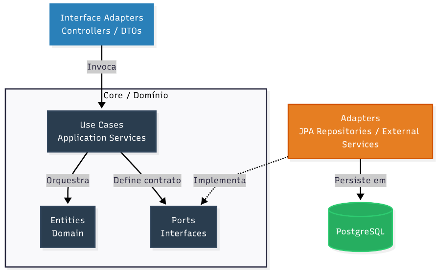

# 🏛️ Arquitetura do Backend: Clean Architecture & Ports and Adapters

Este documento descreve as decisões e padrões arquiteturais adotados no backend do **Projeto IRR**.

Nosso objetivo com esta arquitetura é garantir que as **Regras de Negócio (Domínio)** sejam o coração da aplicação, permanecendo completamente isoladas de frameworks, bancos de dados e interfaces de usuário. Isso garante alta testabilidade, manutenibilidade e flexibilidade para o futuro.

---

## 🧭 A Regra de Ouro: A Regra de Dependência

A base da nossa arquitetura é a **Regra de Dependência**. As dependências no código-fonte devem apontar *sempre* para dentro, em direção às políticas de nível mais alto (o Domínio).

A camada de domínio não sabe absolutamente nada sobre HTTP, JSON, Spring Boot ou PostgreSQL.

---

## 🗺️ O Fluxo da Arquitetura

O sistema é dividido em camadas bem definidas, seguindo o fluxo ilustrado abaixo:

    

<em>Fluxo de dependência apontando para o Domínio (Entities).</em>

## 1. Interface Adapters (Adaptadores de Entrada)

**Componentes:** Controllers, DTOs.

**Responsabilidade:** Traduzir o mundo externo para o formato que a nossa aplicação entende, e vice-versa.

**Comportamento:** Recebem as requisições HTTP, validam a estrutura do payload JSON (usando DTOs) e repassam os comandos para a camada de Serviços (Use Cases). Retornam as respostas formatadas em HTTP (200, 201, 400, etc.).

## 2. Use Cases (Application Services)

**Componentes:** Services (ex: `VehicleService`).

**Responsabilidade:** Orquestrar o fluxo específico de uma funcionalidade do sistema.

**Comportamento:** Buscam entidades no banco de dados (através das Ports), invocam os métodos de negócio dessas entidades (Modelos Ricos) e salvam o novo estado. Esta camada não contém regras de negócio intrínsecas da entidade, apenas a "coreografia" do caso de uso.

## 3. Entities (Domínio)

**Componentes:** Models (ex: `Vehicle`), Exceptions de domínio.

**Responsabilidade:** Representar os conceitos reais do negócio e proteger as regras universais (Invariantes).

**Comportamento:** Utilizamos o padrão de **Rich Domain Model** (Modelo Rico). As entidades não são apenas "sacos de dados" (getters/setters). Elas possuem métodos de negócio que alteram seu próprio estado de forma segura (ex: `vehicle.inativar()`).

## 4. Ports (Portas)

**Componentes:** Interfaces no pacote de domínio (ex: `VehiclePort`, `AuthenticatedUserProvider`).

**Responsabilidade:** Definir os contratos que a camada de Domínio precisa que o mundo externo cumpra.

**Comportamento:** Aplicação direta do **Princípio da Inversão de Dependência (DIP)**. O Serviço diz: "Eu preciso de algo que salve um veículo", e cria uma Porta (interface) para isso. Ele não sabe como isso será salvo.

## 5. Adapters (Adaptadores de Saída / Infraestrutura)

**Componentes:** JPA Repositories, Integrações via Spring Security, APIs Externas.

**Responsabilidade:** Implementar os contratos definidos pelas Ports.

**Comportamento:** São as classes "sujas" que conversam com os frameworks. Elas traduzem os comandos do domínio para a linguagem SQL (via Hibernate/Spring Data) ou para integrações externas.

## 6. Banco de Dados (PostgreSQL)

A camada mais externa da aplicação. O banco de dados é tratado apenas como um detalhe de implementação, responsável por garantir a persistência, integridade (Constraints) e velocidade (Índices) dos dados estruturados.

## 🛠️ Exemplo Prático do Fluxo (Inativação de Veículo)

1. O Controller (Interface Adapter) recebe um `DELETE /api/veiculos/5`.
2. O Controller chama o método `deactivate(5)` do `VehicleService` (Use Case).
3. O Service pede para a Porta buscar o veículo de ID 5. O Adapter (JPA) vai no PostgreSQL, busca o dado e o entrega.
4. O Service invoca o método de negócio na Entidade: `vehicle.deactivate()`. A Entidade muda seu estado interno para falso.
5. O Service finaliza a transação, e o Adapter do Hibernate atualiza o PostgreSQL automaticamente (Dirty Checking).