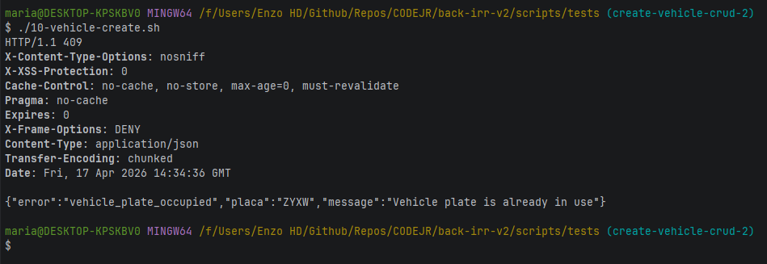

Vehicle Service: O vazamento de escopo (Session) desapareceu, a injeção de dependência está correta com o Provider, a paginação foi implementada e a performance de I/O foi otimizada com o getReferenceById.

